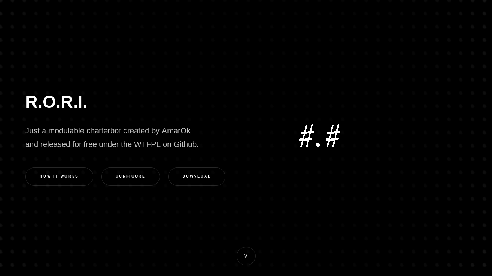
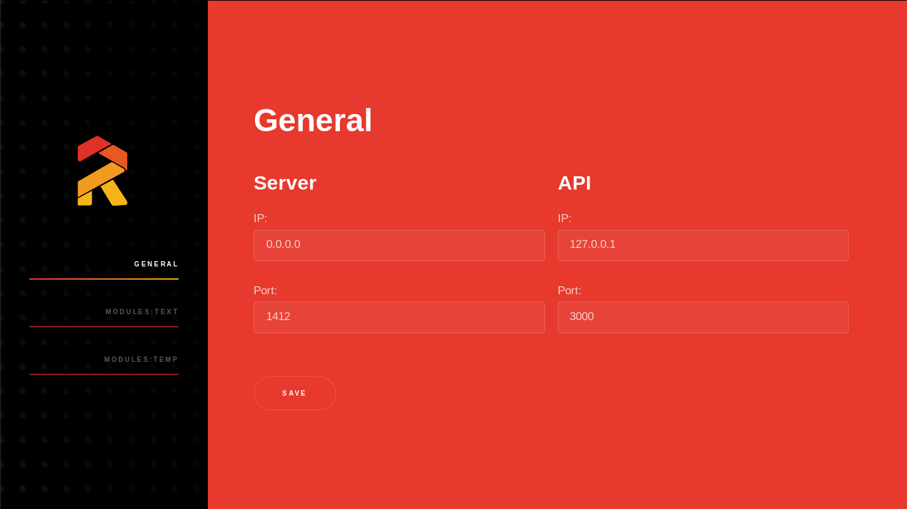
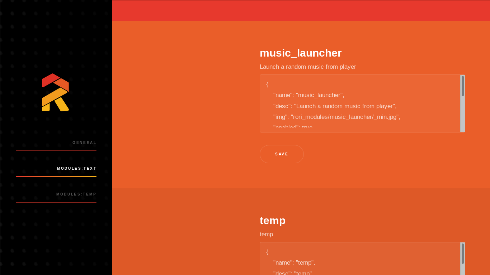

**Disclaimer: This is a draft version**

# rori_www

This is a website created to present what is _[RORI](https://github.com/AmarOk1412/rori/)_ and to configure an instance.

# Screenshots







# Configure

In _downloads.json_ you can configure the index page. You just have to add entries like this:

```json
{
  "img":"images/rori_server.png",
  "name":"Core Server",
  "description":"This is the central point of RORI. This application get data from entry points, call modules to process this data and send data to endpoints to execute commands.",
  "url":"https://github.com/AmarOk1412/rori_server"
}
```

In _configure_part.json_ you can configure which is the path to configurate `rori_server` and which modules groups you want to configure. For example:

```json
{
  "General":"config_server.json",
  "Modules:text":"text.json",
  "Modules:temp":"temp.json"
}
```

This configuration will show the third screenshot.

# TODO

- A video to present what is RORI
- A list of all available entry, endpoints and modules.
- [sshweb](https://vtllf.org/sshweb.html) (I think it's fun)
- Configure an instance

# License

```
DO WHAT THE FUCK YOU WANT TO PUBLIC LICENSE
        Version 2, December 2004

Copyright (C) 2016 Sébastien (AmarOk) Blin <https://enconn.fr>

Everyone is permitted to copy and distribute verbatim or modified
copies of this license document, and changing it is allowed as long
as the name is changed.

DO WHAT THE FUCK YOU WANT TO PUBLIC LICENSE
TERMS AND CONDITIONS FOR COPYING, DISTRIBUTION AND MODIFICATION

0\. You just DO WHAT THE FUCK YOU WANT TO.
```

# Contribute

Please, feel free to contribute to this project in submitting patches, corrections, opening issues, etc.
